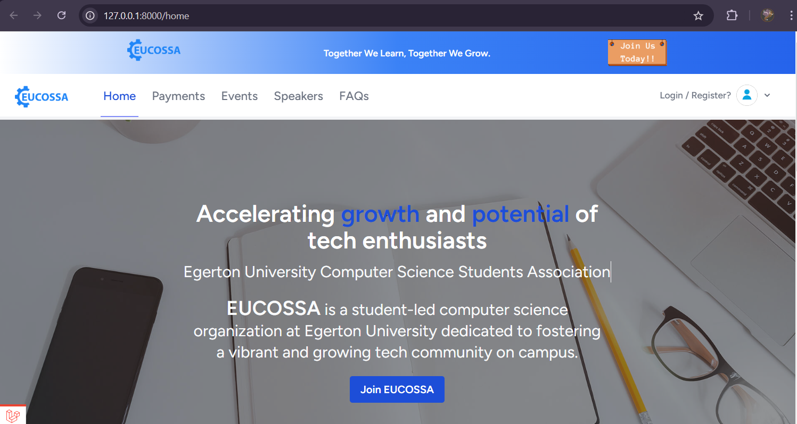
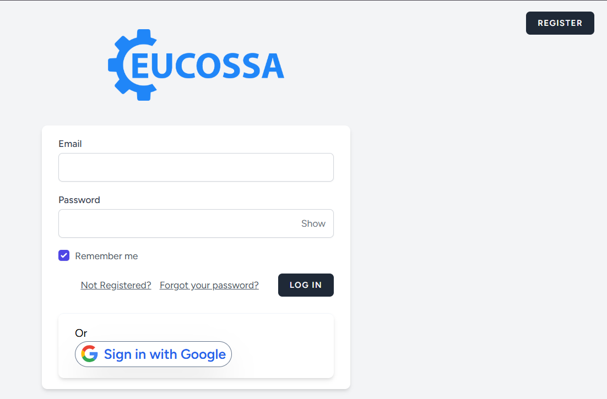
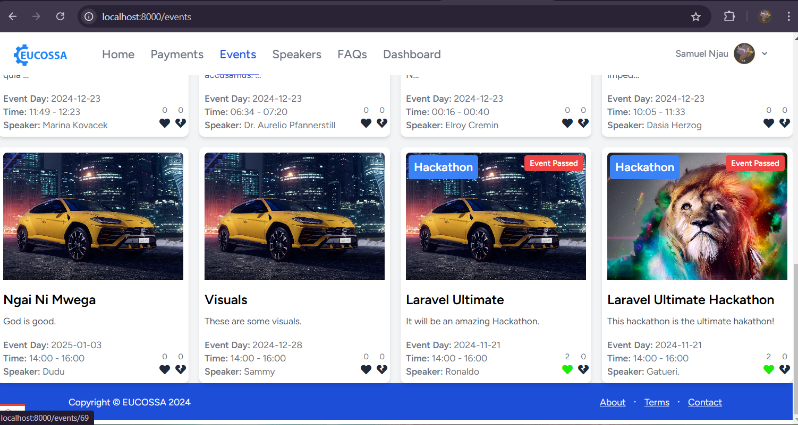

# EUCOSSA

EUCOSSA (Egerton University Computer Science Students Association) is a web application designed for computer science students to interact and engage through club events, preserve the club’s history, and manage membership. The platform integrates payments via Daraja, event posting, and email notifications, and supports speaker applications for events. It is built with Laravel and Vue.js using Inertia.js for a seamless experience and is hosted at [eucossa.com](https://eucossa.com).

---

## Features
- **Event Management**: Users can post events and receive notifications via email.
- **Speaker Applications**: Apply to be a speaker at club events directly on the platform.
- **Club History Preservation**: Archive and showcase the club’s rich history.
- **Membership Payments**: Integrated payment processing via Daraja for seamless transactions.
- **Interactive Frontend**: Powered by Vue.js and Inertia.js for a dynamic user experience.

---

## Screenshot

****
****
****

Add a screenshot of the application’s UI here to give users a quick visual overview of EUCOSSA.

---

## Installation and Setup

Follow these steps to run EUCOSSA locally:

### Prerequisites
- PHP 8.1 or higher
- Composer
- Node.js & npm
- MySQL database
- Git

### Steps

1. **Clone the Repository**
   ```bash
   git clone https://github.com/EUCOSSA-Official-Website/Egerton-Website.git
   cd eucossa
   ```

2. **Install Dependencies**
   - Backend dependencies:
     ```bash
     composer install
     ```
   - Frontend dependencies:
     ```bash
     npm install
     ```

3. **Environment Setup**
   Copy the `.env.example` file to create a `.env` file and configure your database credentials and API keys.
   ```bash
   cp .env.example .env
   ```
   Update the following lines in the `.env` file:
   ```env
   DB_DATABASE=your_database_name
   DB_USERNAME=your_database_user
   DB_PASSWORD=your_database_password
   DARJA_API_KEY=your_daraja_api_key
   ```

4. **Generate Application Key**
   ```bash
   php artisan key:generate
   ```

5. **Run Migrations and Seeders**
   ```bash
   php artisan migrate --seed
   ```

6. **Build Frontend Assets**
   ```bash
   npm run dev
   ```

7. **Start the Development Server**
   ```bash
   php artisan serve
   ```
   Access the application at `http://localhost:8000`.

---

## Usage
- Post and manage events with automatic email notifications.
- Apply as a speaker for upcoming events.
- Preserve and explore the club’s history.
- Make membership payments securely through Daraja.

---

## Contributing
Contributions are welcome! Please fork the repository and submit a pull request with your improvements. 

**Contributors**
- [Samuel Njau](https://www.linkedin.com/in/samuel-njau/)

---

## License
This project is licensed under the [MIT license](https://opensource.org/licenses/MIT). See the LICENSE file for details.
